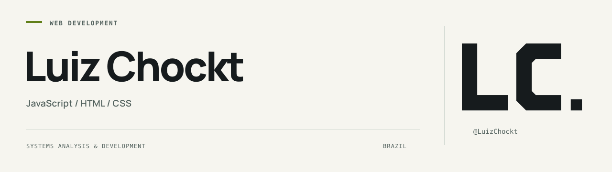

<picture>
  <source media="(prefers-color-scheme: dark)" srcset="./assets/banner-dark.svg">
  <source media="(prefers-color-scheme: light)" srcset="./assets/banner-light.svg">
  
</picture>

[Português](./README.pt-BR.md) · [Repositories](https://github.com/LuizChockt?tab=repositories)

## Hi, I'm Luiz.

I'm a **Systems Analysis and Development (ADS) graduate** based in Brazil, focused on **web development with JavaScript, HTML and CSS**.

I use this space to share study projects, improve their interfaces and document the decisions behind the code.

## Selected study projects

| Project | Focus | Links |
| --- | --- | --- |
| **JavaScript Calculator** | Arithmetic, browser interactions and interface design. | [Code](https://github.com/LuizChockt/CalculadoraAprendizadoJS) · [Live demo →](https://luizchockt.github.io/CalculadoraAprendizadoJS/) |
| **School Grade Calculator** | Average calculations, input validation and clear feedback. | [Code](https://github.com/LuizChockt/Media-Escolar-Calc) · [Live demo →](https://luizchockt.github.io/Media-Escolar-Calc/) |

## Technical foundation

**JavaScript** for application logic and browser interactions. **HTML** for structure. **CSS** for layout and presentation.

My current focus is strengthening these fundamentals through small, practical web projects.

<strong>Background & direction</strong>

- Graduate in Systems Analysis and Development (ADS).
- Based in Brazil.
- Building a portfolio for opportunities in web development.
- Interested in practical tools, clear interfaces and well-documented code.

